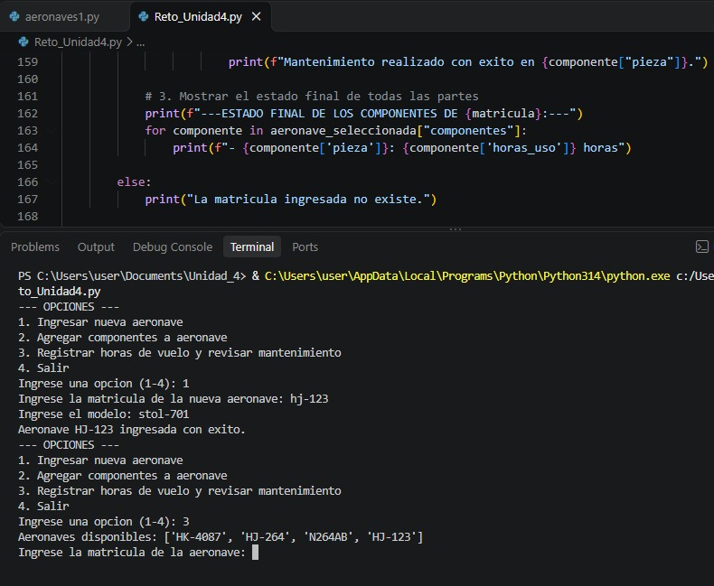
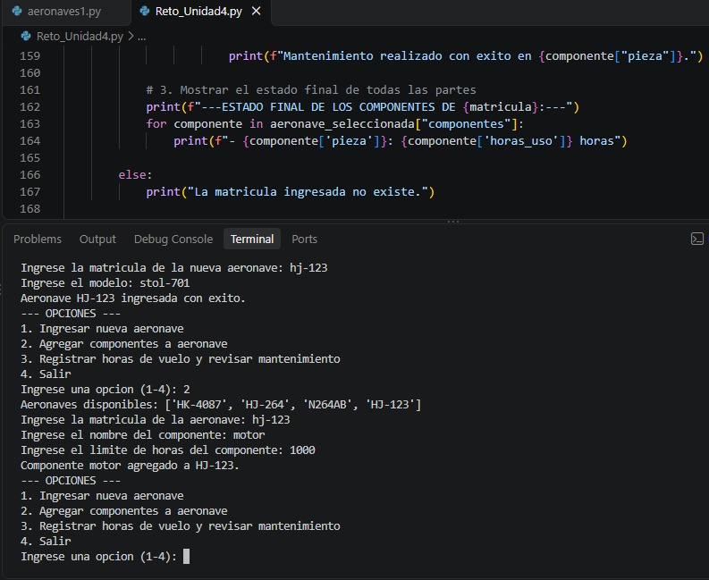
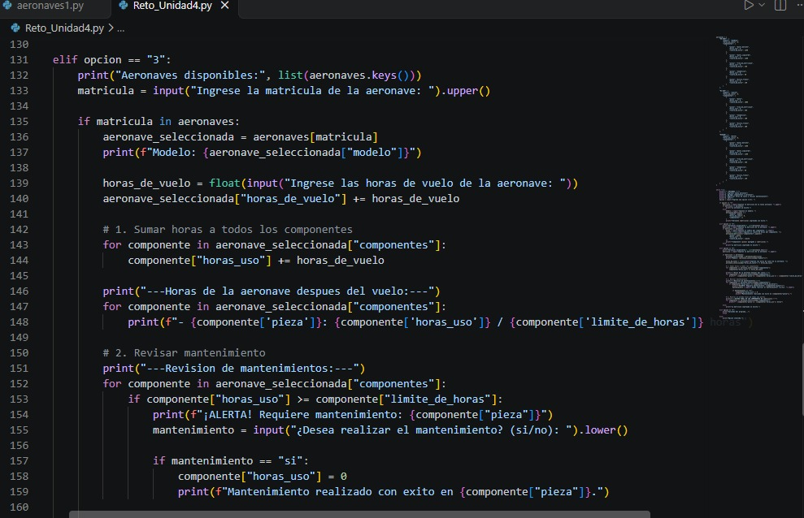
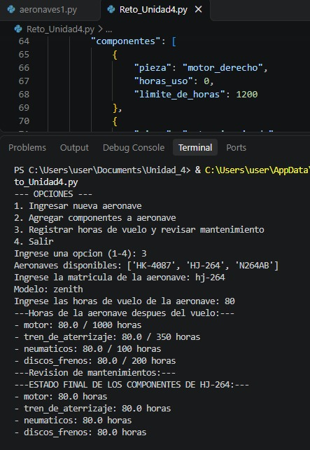

# Pruebas Evaluacion Reto 4
## 1.Registrar un nuevo avión 🛩️

## 2.Agregar componente a el nuevo avion 🛫

## 3. Partes de codigo:

### a) Agregar las horas de uso
* Explicación: Las primeras líneas del codigo me dicen las aeronaves disponibles y luego este me pide ingresar unas de las aeronaves para agregarles horas_uso. Luego compara las horas_uso con el limite_de_horas de cada pieza que tiene esa aeronave. Me imprime una lista de las piezas de esa aeronave con las horas depués del vuelo y me pregunta si que reparar las que superaron o igualaron las horas limites.Si la respuesta es si se reinician las horas de esos componentes que se repararon y vuelve a mostrar como quedaron las piezas de la aeronave depués del mantenimiento.  
Las horas de uso de guardan en una lista de diccionarios en componentes 

## 4. Reporte:

